# Continuous Deployment

## Release Pipeline

Azure DevOps provides Release pipelines for Continuous Deployment. These pipelines are responsible for creating Azure Resources and deploying code on these Azure resources. We will divide this workshop into two parts: -> Creating Utilities and UnbreakablePipelineDemo-CD

## 5(a) Creating Utilities
As a part of the workshop we will create 4 Resources in Azure cloud. These are as follows:

1. Virtual Machines - Staging and Production: The VM's are the infrastructure where the sample application is deployed. First the application is deployed to Staging and if it passes the Quality Gate it is moved to Production. 
2. Azure Functions - MonspecValidation and SelfHealing: These Azure functions have specific purposes

**MonspecValidation**: After the build is deployed to Staging it needs to pass a Quality Gate which checks for Performance signature of the application to validate if the build can be moved to production. 

**SelfHealingFunction**: In the case that a bad build makes it to Production, Dynatrace opens a problem and makes a call to the Self Healing function. The function then makes calls to Azure Devops API and reverts back to a previous good build. 

**Dynatrace One Agent**: The Dynatrace Oneagent is installed on both Staging and Production VM's for monitoring 

## Setting up Create Utilities Pipeline 
1. Select the Create Utilitles Pipeline and click on Edit
2. In the Pipeline view, there are some items that need attention. Click on the 2 Jobs, 8 Tasks. 
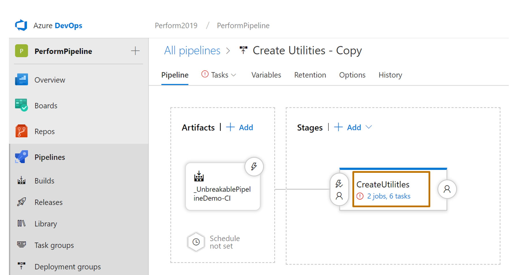
3. Set Agent Job to be Hosted VS2017

4. Update the tasks with appropriate values
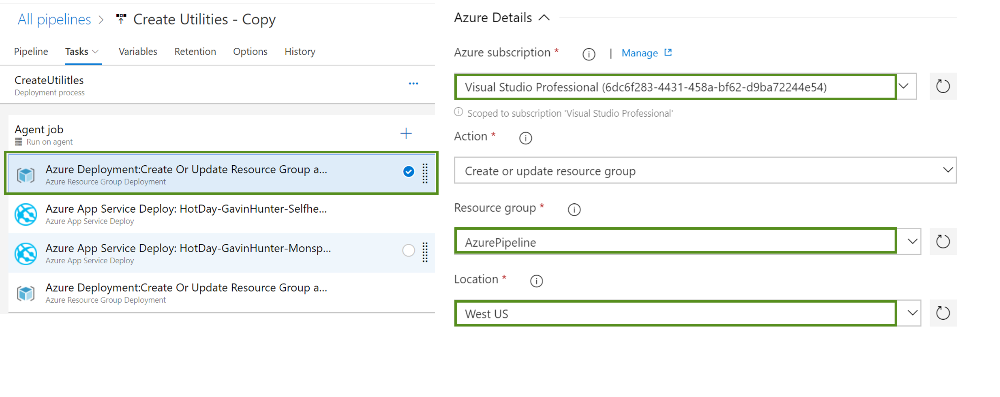
5. Update the tasks with appropriate values

6. Create a New Service Connection

7. Update the Deployment Group Name
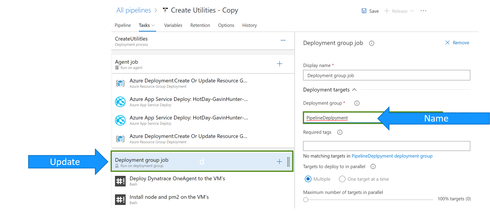
8. Go to Variables and update the Dynatrace-Tenant and Dynatrace Token information

9. Save and create a new release 

## Expected Output
1. Login to Dynatrace tenant to verify that the OneAgent is installed on two hosts: 
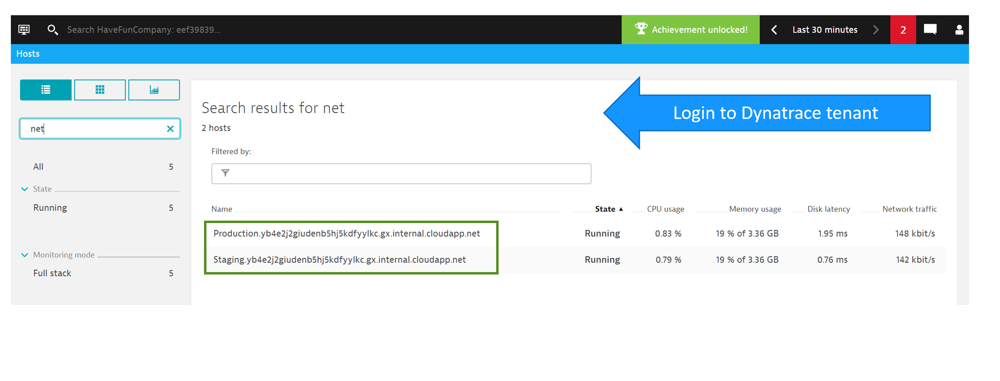
2. Login to Azure portal and ensure that the following resources are created
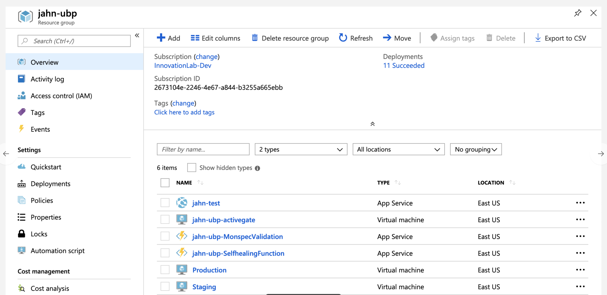

## 5(b) UnbreakablePipelineDemo-CD
This section is to update the pipeline which will deploy the sample application and run the Quality gate. 

## Setting up UnbreakablePipelineDemo-CD
1. Update the UnbreakablePipelineDemo-CD by clicking on Edit -> and Select Staging environment
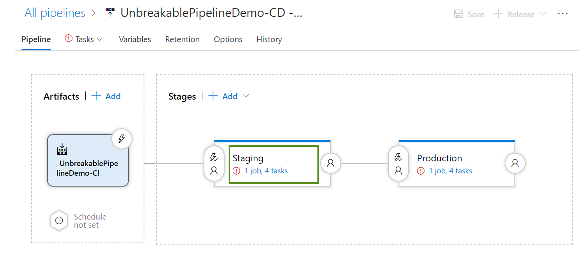 
2. For the Deployment Group Job, add the name of the Deployment group created previously and add Staging in the required tags section
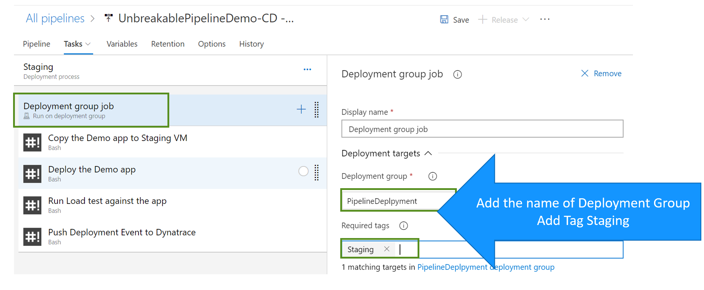
3. Select Production in task and update the Tag to Production 
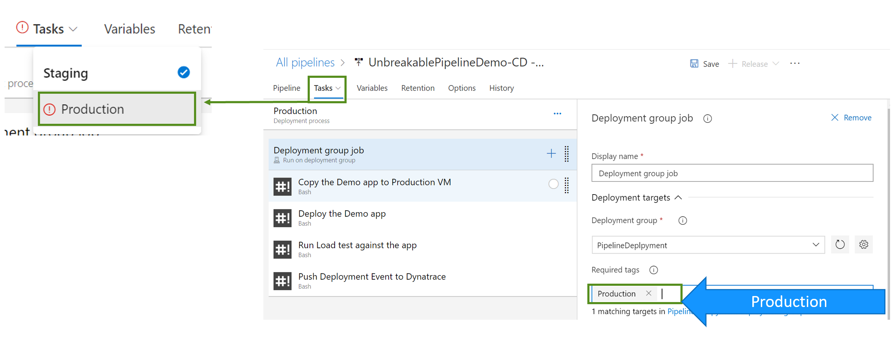
4. Go to Variables -> Enter Dynatrace Tenant, Dynatrace token, Dynatrace API Token

5. Configure the Quality Gate -> Click on the gate and Enable Gates. Add a new Gate and select Azure Function. Enter the function URL (get this from Azure Portal and append: /api/validatePerfSig. 
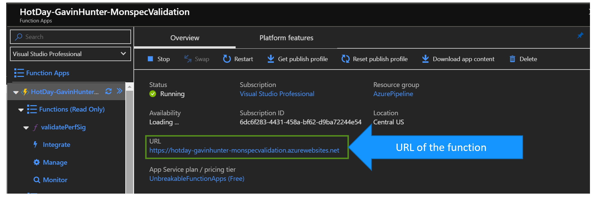
Enter the Function Key which is available in the Azure Portal
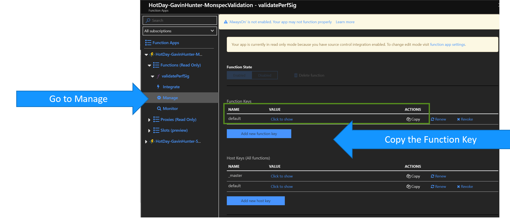
Enter these values in the Azure Devops Gate
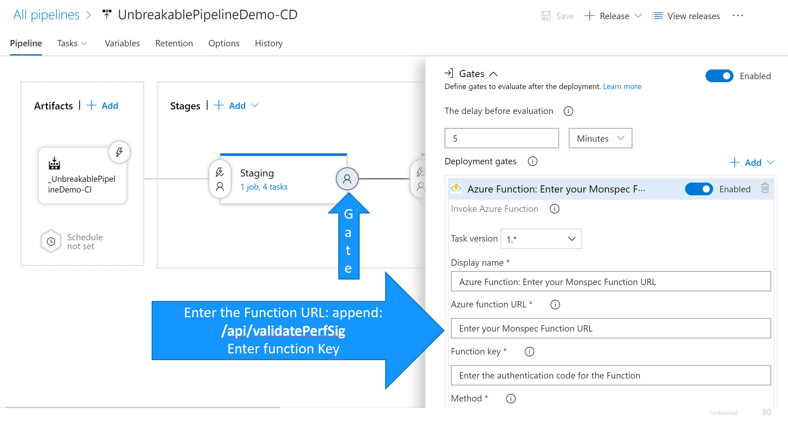
6. 

