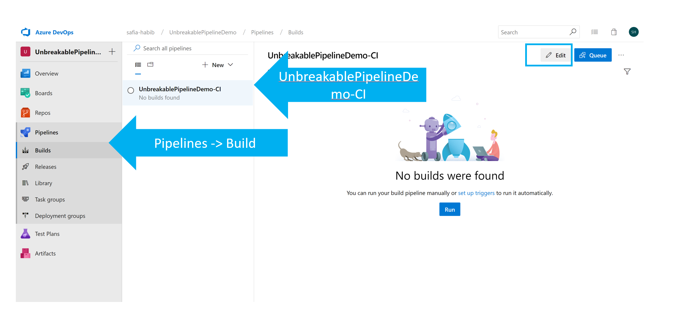
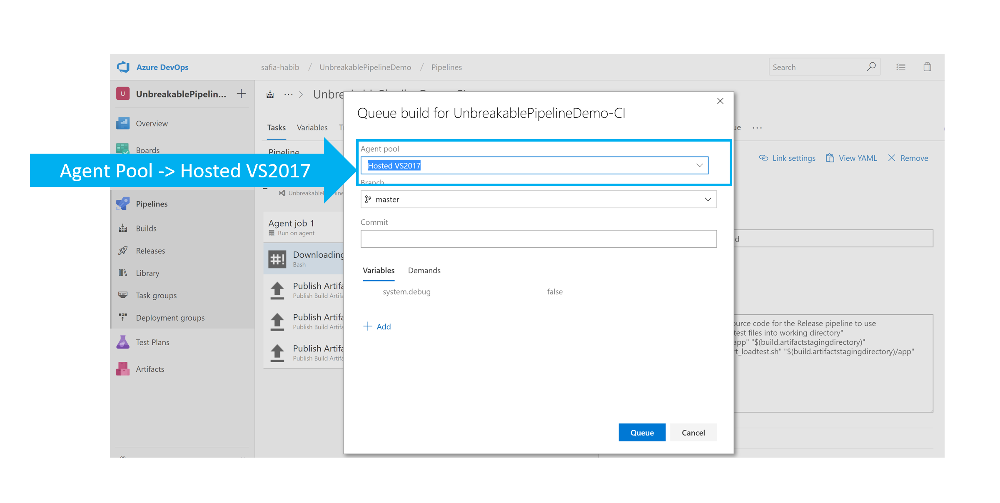
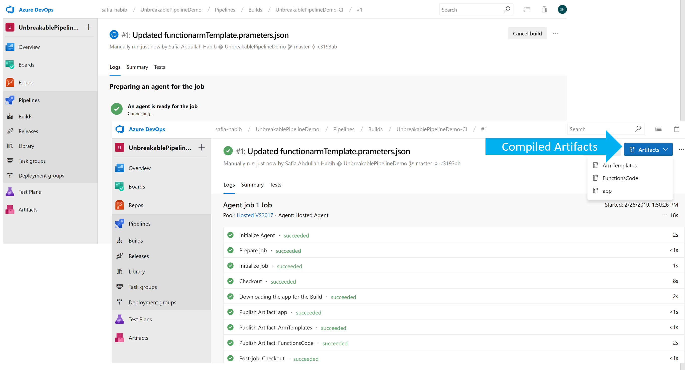

# Continuous Integration

## What is Build Pipeline?
The pipelines in Azure Devops are separated into Build and Release Pipelines. Build Pipeline consists of tasts to build the code. 

## How to use it?
1. Go to Pipelines -> Builds
2. You Click Edit for UnbreakablePipeline-CI 

3. Inspect the tasks: Since we are using a NodeJS sample application there are no steps to compile the application. We are just publishing artifacts which will be used by the Release Pipeline for Continuous Deployment. 
4. Queue a Build: 

## What is the expected output?
When as the Build runs the Azure Devops agent will start executing the Build tasks and make artifacts. The process looks as follows: 

There are 3 Artifacts being compiled by this pipeline:

1. **ArmTemplates:** The Azure Resource Manager templates are used by the release Pipeline to create Azure Resources. 
2. **FunctionsCode:** The fully compiled code for the Azure Functions to be deployed by the release Pipeline.
3. **app:** The Sample NodeJS application to be deployed on Azure VM's to see the functioning of the Quality Gate and the Remediation as Code

